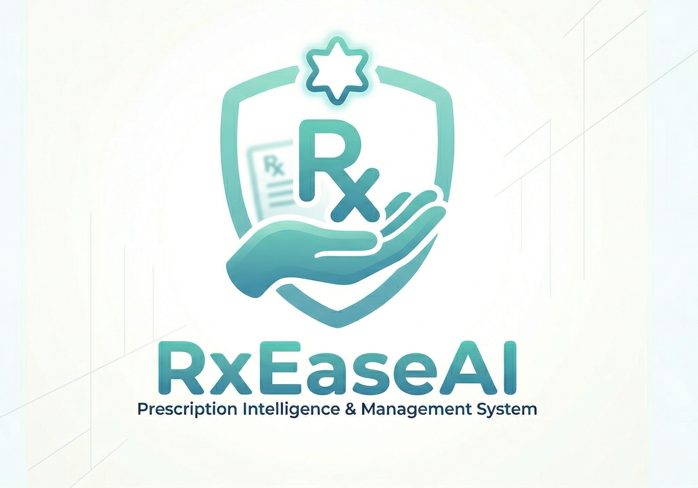

# RxEaseAI - AI-Powered Prescription Ingestion ✨

<div align="center">



**Transform handwritten prescriptions into structured clinical intelligence. RxEaseAI is a frontend experience that showcases fast ingestion, safety checks, and real-time analytics for pharmacy workflows.**

     


</div>
---

## 🌐 Live Demo

- 🚀 RxEaseAI Website: [View Live Portfolio](https://RxEaseAI.vercel.app/)
---

## One-line summary

- RxEaseAI is a modern UI that simulates OCR ingestion, dosage safety checks, operational analytics, and secure authentication for pharmacies and hospital networks.

---

## Key facts (quick)

- Target: sub-2s ingestion and 74% OCR accuracy (validated dataset)
- YOLO-based segmentation with medical OCR concepts
- FHIR/HL7-ready structured output
- React 19, Vite 8, Tailwind CSS v4, Framer Motion
- Full custom Authentication Flows with interactive form validation (React Hook Form + Zod)
- Protected Routing and global mock session state (AuthContext)

---

## Scope and purpose (repo-specific)

- This repository contains the frontend UI and interactions only.
- Backend services, model hosting, datasets, and compliance systems are not included here.

---

## Features and capabilities

- **🔍 YOLO Vision Region Detector:** Automatically detects and isolates text regions, lines, and tokens to reduce handwriting noise.
- **🩺 Specialized Medical OCR:** Translates challenging doctor handwriting into legible clinical transcripts.
- **💊 Clinical Dosage Audit Engine:** Flags drug interactions, high-risk quantities, and age-limit warnings.
- **📚 Complete Prescription Archive & Audit Log (`#history`):** Searchable, filterable prescription repository featuring paginated tables, live action logs (exports, shares, deletions), multi-prescription bulk PDF export, and seamless fallback browser-native PDF generation.
- **🔗 Secure Prescription Sharing (`ShareModal` & `shareService`):** Generate secure shareable tokens or email clinical audit reports directly from the History dashboard.
- **⏰ Integrated Medication Reminders (`#reminders`):** Manage active schedules and clinical follow-up reminders.
- **🔔 Categorized Notification Center (`#notifications`):** Filter high-priority alerts and unread notifications with responsive pagination.
- **📊 Operational & Clinical Analytics (`#analytics`):** Real-time metrics tracking ingestion volume, confidence scores, and workflow efficiency.
- **🔐 Complete Authentication Flow:** Includes fully validated forms for Sign In, Sign Up, Forgot Password, Reset Password, and Email Verification.
- **⚡ Form Validation:** Powered by React Hook Form + Zod for centralized, strict schema-based error handling.
- **🛡️ Live Password Security:** Interactive password strength indicators ensuring HIPAA-compliant credential creation.
- **🔒 Protected Routes:** Role-based guard components to block unauthenticated access to the home page.
- **🌗 Adaptive Theme System:** Clean light/dark mode with FOUC-resistant startup logic.
- **🧩 Reusable UI Architecture:** Component-driven design using highly reusable abstractions (Buttons, Icons, Cards, Badges, Modals).

---

## How it works

1. **Authenticate:** Securely sign up or log in to the HIPAA-compliant home page.
2. **Segment & Transcribe:** Vision model isolates handwriting regions and converts text into structured clinical data.
3. **Audit & Safety Check:** Safety engine validates dosages and checks drug interactions.
4. **Archive & Audit Log:** Prescriptions are archived in the History Center with immutable activity logs.
5. **Export & Share:** Export single or combined PDF audit reports or share secure clinical tokens with patients and physicians.
6. **Observe:** Analytics views surface throughput, accuracy metrics, and medication adherence.

---

## Where to edit content (quick paths)

- Page composition: `src/pages/LandingPage.jsx`, `src/pages/HomePage.jsx`
- Prescription Workflow: `src/pages/prescription/UploadPage.jsx`, `src/pages/prescription/ResultPage.jsx`
- Auth Pages: `src/pages/auth/SignIn.jsx`, `src/pages/auth/SignUp.jsx`, `src/pages/auth/ResetPassword.jsx`, `src/pages/auth/ForgotPassword.jsx`, `src/pages/auth/VerifyEmail.jsx`
- Sections: `src/components/sections/landing/` and `src/components/sections/home/`
- Layout: `src/components/layout/`
- Auth Components: `src/components/auth/`
- UI primitives: `src/components/ui/`
- State stores: `src/store/`
- Global styles: `src/index.css`

---

## Project structure

```bash
src/
  ├── components/
  │   ├── auth/          # Auth components & Route guards (PasswordStrengthPanel, ProtectedRoute, PublicRoute)
  │   ├── layout/        # Macro layouts (Navbar, Footer, SideNavbar)
  │   ├── sections/      # Sections grouped by view
  │   │   ├── home/      # HomeHero, HomeWorkflow, HomeFeatures, HomeSecurity, HomeFaq, HomeCTA
  │   │   └── landing/   # Hero, Features, Workflow, Dashboard, Analytics, Faq
  │   └── ui/            # Reusable primitives (Button, Card, Badge, MaterialIcon, Input, Modal, etc.)
  ├── services/          # Domain API services (authService, prescriptionService, shareService, etc.)
  ├── store/             # Zustand Global State with Persistence Middleware
  │   ├── useAuthStore.js # Session, JWT tokens, login, logout (`rxease-auth-storage`)
  │   ├── useThemeStore.js # Theme management and DOM dark-mode syncing
  │   ├── usePrescriptionStore.js # Ingestion cycles, OCR tracking, and clinical history (`rxease-prescription-storage`)
  │   └── useAppStore.js # Sidebar state, user settings, and toast notifications (`rxease-app-storage`)
  ├── pages/
  │   ├── LandingPage.jsx # Main Marketing Landing Page (`/`)
  │   ├── HomePage.jsx    # Protected Application Home Dashboard (`#home`)
  │   ├── prescription/   # Prescription Ingestion & Clinical Intelligence
  │   │   ├── UploadPage.jsx # Step 1: File Ingestion, Camera Snapshot & OCR Processing (`#upload`)
  │   │   ├── ResultPage.jsx # Step 2: Clinical Intelligence Result Dashboard (`#result`)
  │   │   ├── HistoryPage.jsx # Historical Prescription Archives (`#history`)
  │   │   ├── HistoryDashboardPage.jsx # Analytics Dashboard (`#history-dashboard`)
  │   │   └── RecommendationPage.jsx # AI Smart Alternatives & Cost Savings (`#recommendations`)
  │   ├── reminder/       # Medication Reminder Center (`#reminders`)
  │   │   └── RemindersPage.jsx
  │   ├── analytics/      # Clinical Intelligence & Adherence Summaries (`#analytics`)
  │   │   └── AnalyticsPage.jsx
  │   ├── search/         # Drug Interaction & Clinical Search Engine (`#search`)
  │   │   └── SearchPage.jsx
  │   ├── notifications/  # System & Clinical Alert Center (`#notifications`)
  │   │   └── NotificationsPage.jsx
  │   ├── billing/        # Localized Pakistan Billing & Subscription OS (`#billing`)
  │   │   └── BillingPage.jsx
  │   ├── settings/       # Profile, Feedback & Support Hub (`#settings`)
  │   │   └── SettingsPage.jsx
  │   └── auth/           # Authentication pages
  │       ├── SignIn.jsx      
  │       ├── SignUp.jsx
  │       ├── ForgotPassword.jsx
  │       ├── ResetPassword.jsx
  │       └── VerifyEmail.jsx
  ├── doc/               # Comprehensive Architecture & Integration Guides
  │   ├── architecture.md, project_structure.md, state_management.md
  │   ├── components.md, form_validation_and_routing.md, theming.md
  │   ├── authentication.md, backend_integration_guide.md
  │   ├── new_features_guide.md # Developer playbook for adding new features
  │   └── api_services.md       # API client & backend service reference
  ├── styles/            # Shared style utilities
  ├── index.css          # Tailwind imports and global styles
  ├── App.jsx            # Routing and Hash-based Navigation
  └── main.jsx           # App entry point
```

---

## Screenshots / Preview (add your own)


| Desktop (Hero) | Analytics | Auth Flow |
|---:|:---:|:---:|
|  |  |  |

-->

---

## Development (local)

Prereqs: Node.js 18+ and npm

```bash
# Install
npm install

# Start dev server
npm run dev

# Build
npm run build

# Preview
npm run preview
```

Notes:
- This project uses Vite for a fast development loop.
- Use `npm run lint` to run ESLint.

---

## Theme system implementation

RxEaseAI prevents theme flicker (FOUC) by injecting a small script in the `<head>` of `index.html` before the React app mounts:

```javascript
(function () {
  const storedTheme = localStorage.getItem('theme');
  const systemDark = window.matchMedia('(prefers-color-scheme: dark)').matches;
  if (storedTheme === 'dark' || (!storedTheme && systemDark)) {
    document.documentElement.classList.add('dark');
  } else {
    document.documentElement.classList.remove('dark');
  }
})();
```

Tailwind CSS v4 dark mode support is enabled via the CSS-first directive:

```css
@custom-variant dark (&:where(.dark, .dark *));
```

---

## Compliance and security (design goals)

- HIPAA-ready ingestion workflow with client-encrypted upload concepts
- SOC 2-style audit logging visuals for pharmacist verification actions
- Robust client-side validation and secure password-strength requirements on all Auth forms

---

## Contributing

- This repo is structured for a single front-end experience.
- Use branches for content updates and open a PR for major layout changes.

---

## Contact

**ANEEB UR REHMAN — Full Stack AI Engineer**  
Email: dev.aneeb.rehman@gmail.com  
GitHub: https://github.com/developer-aneeb
LinkedIn: https://www.linkedin.com/in/aneeb-ur-rehman-528a50299/