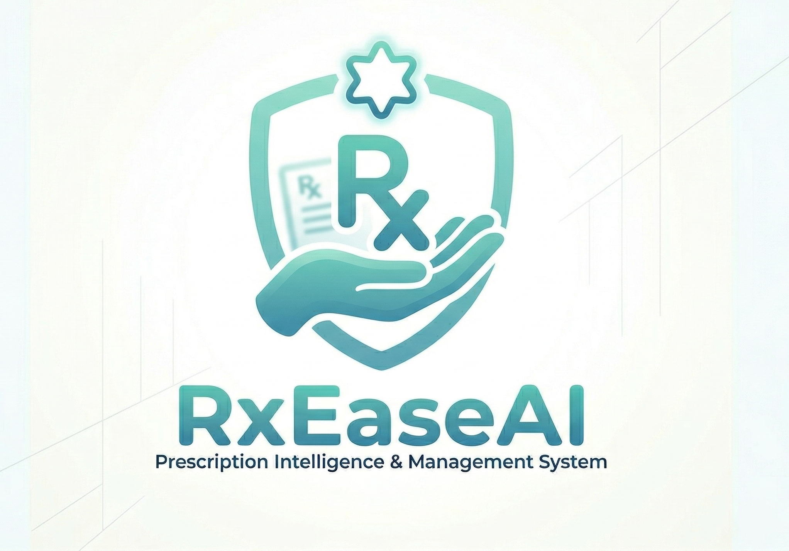

# RxEaseAI - AI-Powered Prescription Ingestion ✨

<div align="center">



 
 
 

 
 

**The modern, high-performance web interface for RxEaseAI. Transforms messy handwritten prescriptions into structured clinical intelligence with lightning-fast ingestion, robust safety checks, and real-time analytics.**

</div>

---

## 🌐 Live Application

- 🚀 **Live RxEaseAI Website:** [rx-ease-ai-web.vercel.app](https://rx-ease-ai-web.vercel.app/)

---

## 🎯 Scope & Purpose

This directory contains the **React 19 Frontend Web Client** for the RxEaseAI ecosystem. 

Unlike previous iterations, **this is no longer just a UI mockup.** This is a fully integrated, production-ready frontend that securely communicates with the RxEaseAI Node.js Backend (Express) and the Python AI Microservice (FastAPI + Vision Models). It handles real JWT authentication, live state management, and real-time multipart image uploads for OCR analysis.

---

## ✨ Features and Capabilities

- **🔐 Robust Authentication Flow:** Fully secured login, signup, forgot password, and email verification flows using JWTs. Includes Protected/Public route guards and rigorous client-side form validation (React Hook Form + Zod).
- **🩺 Clinical Prescription Ingestion:** Seamless drag-and-drop or camera uploads. The client handles large multipart/form-data payloads, sending them to the backend while gracefully managing loading states (up to 2 minutes) and 503 fallback errors when AI GPU quotas are exceeded.
- **📚 Complete Prescription Archive (`#history`):** A fully searchable, filterable repository of the user's uploaded prescriptions, fetched dynamically from the backend database (Supabase via Node). Features bulk PDF export.
- **💡 AI Smart Alternatives (`#recommendations`):** Renders affordable generic alternatives dynamically calculated by the AI engine, saving patients money while ensuring identical dosage and generic formulations.
- **🌗 Adaptive Theme System:** A flawless Light/Dark mode toggler integrated directly with Tailwind v4, utilizing a fast CSS-first directive and a startup `<head>` script to entirely eliminate Flash of Unstyled Content (FOUC).
- **🧩 Reusable UI Architecture:** Component-driven design using highly reusable, accessible primitive components (Buttons, Inputs, Modals, Badges) engineered with Tailwind and Framer Motion for micro-animations.
- **⚡ Centralized State Management:** Powered by Zustand. We utilize persistent, segmented stores (`useAuthStore`, `useAppStore`, `usePrescriptionStore`) to cleanly separate domain logic from UI rendering.

---

## ⚙️ How it works (Data Flow)

1. **Authentication:** The user logs in. `authService.js` makes a request to the Node backend, receives a JWT, and securely stores it via Zustand. Axios interceptors automatically attach this token to all future requests.
2. **Ingestion (`UploadPage.jsx`):** The user uploads a photo. `prescriptionService.js` sends it to the Node backend (`/api/v1/ai/analyze`), which forwards it to the Python AI Pipeline.
3. **Graceful Handling:** If the AI Pipeline rejects the image (e.g. it's a picture of a dog, or the HuggingFace zeroGPU quotas are maxed out), the frontend seamlessly catches the `422` or `503` error and displays a user-friendly error toast.
4. **Results (`ResultPage.jsx`):** On success, the UI parses the structured JSON returned by the backend, rendering the transcribed medicine names, dosages, and matched clinical database IDs.
5. **History (`HistoryPage.jsx`):** The frontend pulls paginated, real-time data from the Node backend to display the user's historical clinical logs.

---

## 💻 Local Development

**Prerequisites:** Node.js 18+ and npm

```bash
# Install dependencies
npm install

# Start the Vite development server
npm run dev

# Build for production
npm run build

# Preview production build locally
npm run preview
```

### Environment Variables
You must create a `.env` file in the `frontend` directory for the client to know where the backend lives:
```env
# Point this to your local Node.js backend (or production URL)
VITE_API_URL=http://localhost:3000/api/v1
```

---

## 📁 Project Structure

```bash
src/
  ├── components/
  │   ├── auth/          # Route guards (ProtectedRoute, PublicRoute) & UI wrappers
  │   ├── layout/        # Macro layouts (Navbar, Footer, Sidebar, Topbar)
  │   ├── sections/      # Large page sections grouped by view (Home, Landing)
  │   └── ui/            # Reusable primitives (Button, Card, Badge, Input, Modal, etc.)
  ├── services/          # Domain API services using Axios (authService, prescriptionService)
  │   └── apiClient.js   # Configured Axios instance with JWT interceptors
  ├── store/             # Zustand Global State with Persistence Middleware
  │   ├── useAuthStore.js
  │   ├── useThemeStore.js
  │   └── usePrescriptionStore.js
  ├── pages/
  │   ├── LandingPage.jsx     # Marketing page (`/`)
  │   ├── HomePage.jsx        # Protected Dashboard (`#home`)
  │   ├── prescription/       # Ingestion (Upload, Result, History)
  │   └── auth/               # Authentication pages (SignIn, SignUp)
  ├── styles/            # Shared style utilities
  ├── index.css          # Tailwind imports and global directives
  ├── App.jsx            # Routing and Hash-based Navigation
  └── main.jsx           # React app entry point
```

---

## 👨‍💻 Maintainer

**ANEEB UR REHMAN — Full Stack AI Engineer**  
Email: dev.aneeb.rehman@gmail.com  
GitHub: [developer-aneeb](https://github.com/developer-aneeb)  
LinkedIn: [Aneeb ur Rehman](https://www.linkedin.com/in/aneeb-ur-rehman-528a50299/)